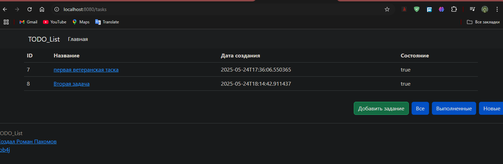
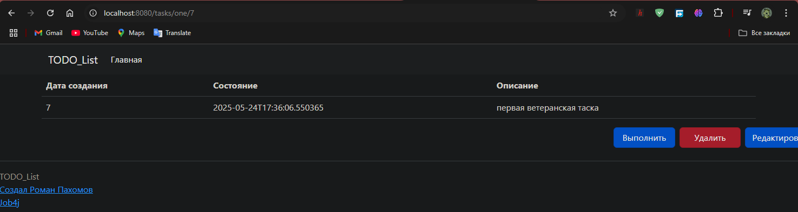
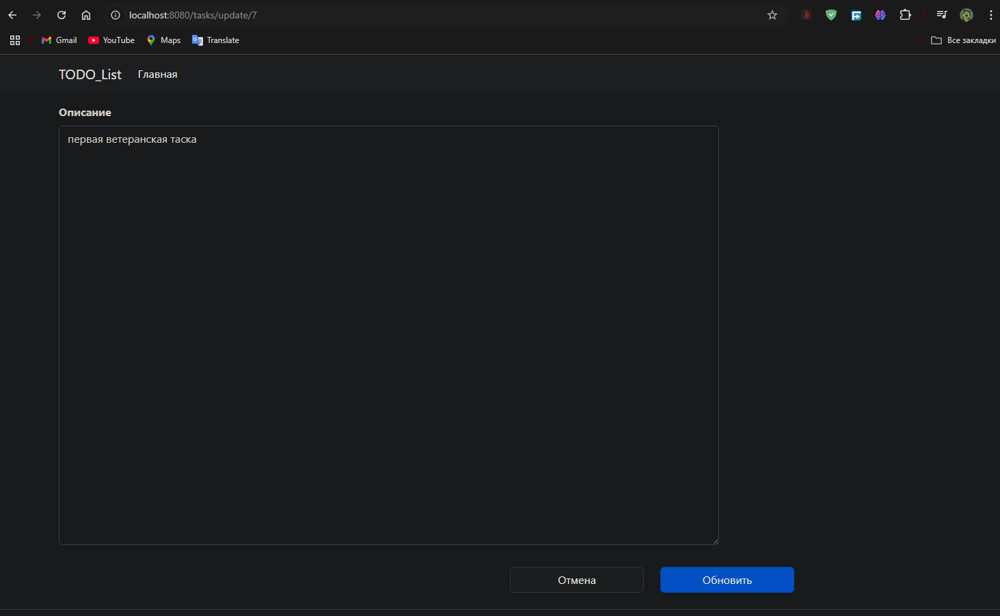
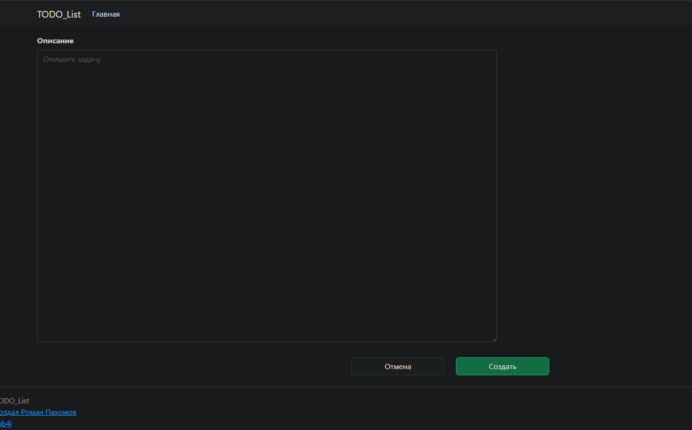

# job4j_todo

Проект представляет собой простейший трекер задач.
Мы можем добавлять задачи, редактировать, выполлнять их и удалять, а так же просматривать полный/отфильтрованные списки.

# Стек технологий:
Java 17
Lombok 1.18.30
Hibernate 5.6.11.Final
PostgreSQL 16
Spring Boot 2.7.3
Liquibase 4.15.0
Maven 3.9.9

# Требования к окружению
Java 17
PostgreSQL 16

# Запуск проекта

1. Склонируйте проект
2. Создайте базу данных ```create database todo;```
3. Укажите ее url, username, password в файлах liquibase.properties и hibernate.cfg.xml
4. Соберите проект через ```mvn package```
5. Запустите приложение, используя файл job4j_todo-1.0.jar

# Взаимодействие с приложением
Список задач



Выбранная задача


Обновление существующей задачи


Создание новой задачи


# Контакты

calvinhobbeson.java@gmail.com